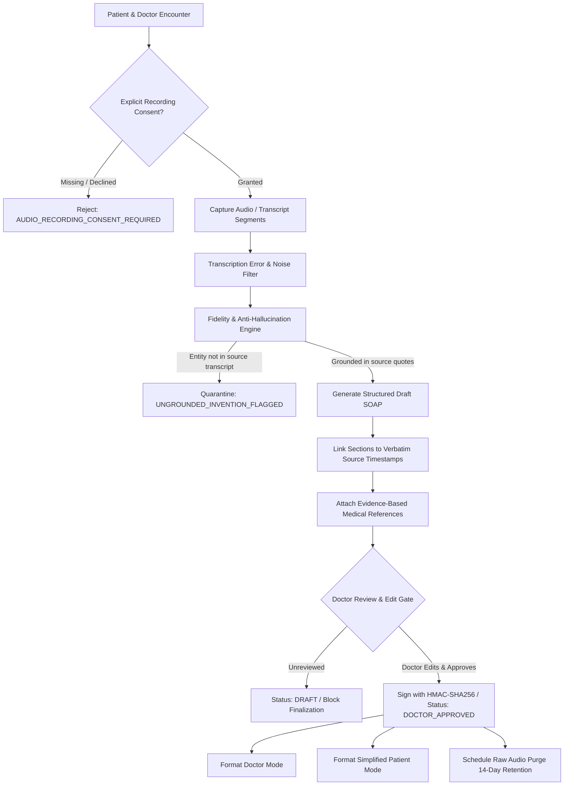

# Health Vibe AI - Clinical Scribe & Doctor Visit Assistant Architecture
## Ambient Voice Summarization, Strict Provenance, Consent, Anti-Hallucination & Dual Modes

---

### 1. Executive Summary & Core Clinical Safeguards

The Health Vibe AI **Clinical Scribe & Doctor Assistant** transcribes and summarizes patient-doctor encounters into structured clinical drafts (SOAP format).

> [!IMPORTANT]
> **Strict Clinical Governance Invariants**:
> 1. **Zero Hallucination / Anti-Invention Guarantee**: The assistant **strictly prohibits inventing** medications, dosages, or clinical symptoms not mentioned in the source audio or transcript. Any ungrounded entity is quarantined with `UNGROUNDED_INVENTION_FLAGGED`.
> 2. **Mandatory Doctor Review Gate**: Every output is generated as an unapproved `draft`. It **cannot** be finalized into medical records, prescriptions, or billing without active review, editing, and cryptographic approval by an authorized physician (`DOCTOR_CREDENTIALS_REQUIRED`).
> 3. **Audio Recording Consent**: Consultations cannot be recorded or processed without mutual, explicit, documented recording consent from both patient and clinician (`AUDIO_RECORDING_CONSENT_REQUIRED`).
> 4. **Retention & Auto-Purging Policy**: Raw audio recordings are subject to a strict 14-day retention policy (auto-purged after draft approval or expiration), retaining only approved structured text and cryptographic hashes for privacy.
> 5. **Source Provenance**: Every clinical statement, symptom, and medication is mapped to timestamped verbatim transcript quotes.
> 6. **Dual Presentation**: Distinct **Doctor Mode** (full clinical SOAP, ICD-10, evidence-based citations) and **Patient Mode** (bilingual, plain language, actionable care steps).

---

### 2. End-to-End Architectural Pipeline



---

### 3. Data Schema & Provenance Mapping

```json
{
  "draftId": "scribe_draft_9821_a7",
  "visitId": "visit_clinic_8829",
  "patientId": "usr_patient_hossam_45",
  "doctor": {
    "uid": "doc_pulmo_adel_402",
    "name": "د. عادل توفيق",
    "licenseNumber": "HV-PULMO-LIC-4491"
  },
  "recordingConsent": {
    "consented": true,
    "patientConsentGranted": true,
    "doctorConsentGranted": true,
    "consentTimestamp": "2026-10-02T10:00:00.000Z",
    "retentionPolicyDays": 14,
    "audioPurgeScheduledAt": "2026-10-16T10:00:00.000Z"
  },
  "rawAudioMetadata": {
    "audioFileId": "audio_rec_9821.m4a",
    "durationSeconds": 485,
    "rawAudioHash": "sha256_e817a...",
    "purged": false
  },
  "status": "draft",
  "fidelityAudit": {
    "isGrounded": true,
    "hallucinatedEntitiesDetected": [],
    "lowConfidenceSegmentsCount": 0
  },
  "structuredSummary": {
    "subjective": {
      "chiefComplaint": "سعال جاف مستمر منذ 4 أيام مصحوب بضيق تنفس خفيف",
      "symptoms": [
        {
          "symptom": "Dry cough",
          "duration": "4 days",
          "sourceLink": { "timestamp": "00:45", "verbatimQuote": "عندي كحة جافة بقالها 4 أيام ومش بنام منها" }
        }
      ]
    },
    "objective": {
      "vitalsMentioned": { "spo2": 96, "pulse": 78, "temperature": 37.2 },
      "physicalExam": "صدر خالي من التزييق الحاد، أصوات تنفسية حويصلية طبيعية"
    },
    "assessment": {
      "clinicalImpression": "Acute Post-Viral Bronchitis",
      "icd10Suggested": "J20.9",
      "differentialDiagnoses": ["Cough-variant asthma", "Mild viral upper respiratory tract infection"]
    },
    "plan": {
      "medications": [
        {
          "name": "Levodropropizine syrup",
          "dosage": "10 ml TID PRN",
          "sourceLink": { "timestamp": "06:12", "verbatimQuote": "هنكتب شراب مهدئ للسعال ليفودروبروبيزين 10 مل تلات مرات" }
        }
      ],
      "investigationsOrdered": [],
      "followUpSchedule": "Review in 5 days if cough worsens or fever develops"
    }
  },
  "evidenceReferences": [
    {
      "guideline": "ERS/ATS Guidelines on Management of Acute Cough",
      "referenceCode": "DOI:10.1183/13993003.01131-2020",
      "summary": "Routine antibiotics not indicated for acute uncomplicated bronchitis in immunocompetent adults."
    }
  ]
}
```

---

### 4. Anti-Hallucination & Anti-Invention Engine

To maintain zero tolerance for AI hallucinations in clinical charts:
1. **Entity Extraction**: The engine identifies all medications, dosages, lab tests, and symptoms in the draft.
2. **Transcript Cross-Referencing**:
   - Every candidate entity is checked against the raw transcription text using phonetic and semantic fuzzy matching.
   - If an entity is absent from the transcript (e.g., AI suggests "Amoxicillin 500mg" or "Chest pain" when neither was uttered in the visit), the engine flags:
     ```json
     {
       "flag": "UNGROUNDED_INVENTION_FLAGGED",
       "entity": "Amoxicillin",
       "type": "MEDICATION",
       "action": "QUARANTINED_FROM_DRAFT",
       "reason": "Not mentioned anywhere in source visit audio/transcript."
     }
     ```
3. **Transcription Noise & Garbled Terms**:
   - Segments with ASR confidence $< 0.70$ are badged with `LOW_CONFIDENCE_TRANSCRIPTION` and highlighted in yellow for doctor clarification.

---

### 5. Dual Presentation Modes

#### Mode 1: Doctor Mode (`mode: 'doctor'`)
- Complete clinical terminology (SOAP format).
- ICD-10 / SNOMED coding.
- Pharmacology, dosage details, contraindications.
- Full evidence-based medical references and clinical practice guideline citations.

#### Mode 2: Simplified Patient Mode (`mode: 'patient'`)
- 5th to 8th-grade plain-language summary.
- Bilingual (Arabic / English).
- Actionable bullet points:
  - "ماذا وجد الطبيب أثناء الفحص" (What the doctor found).
  - "الأدوية وكيفية تناولها" (Your medications and how to take them).
  - "علامات الخطر التي تستدعي زيارة الطوارئ فوراً" (Red flag symptoms).
  - "موعد الزيارة القادمة" (Your next appointment).
- Translates medical jargon into plain words (e.g., replaces "Bronchospasm" with "ضيق خفيف في الشعب الهوائية").
