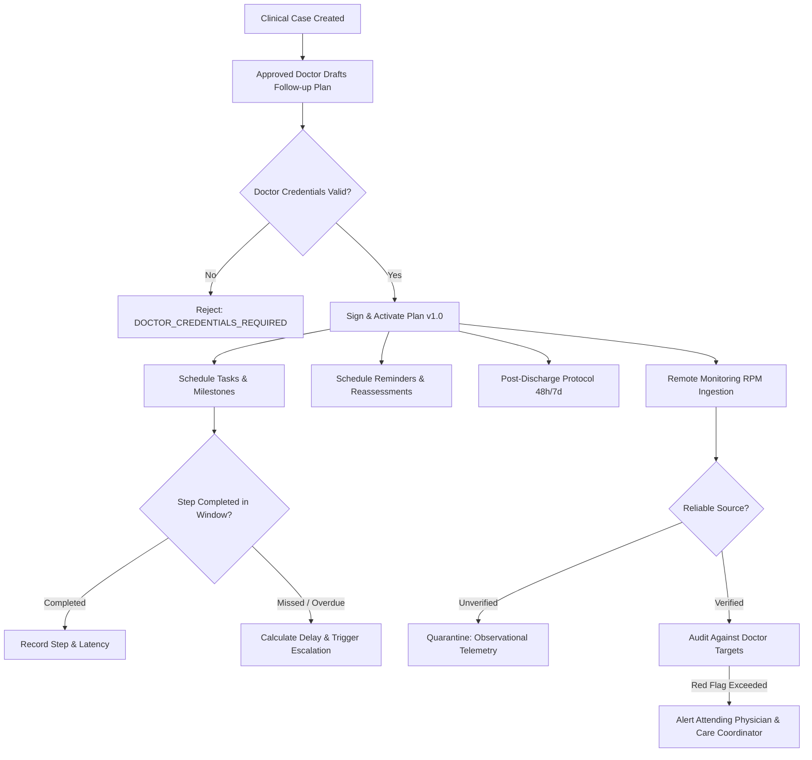

# Health Vibe AI - Doctor-Approved Case Follow-Up & Post-Discharge Architecture
## Task Tracking, Escalation Engine, Patient Risk Timeline & Remote Monitoring

---

### 1. Executive Summary & Clinical Governance Boundary

The Health Vibe AI **Case Follow-Up & Remote Monitoring System** establishes closed-loop care protocols across clinical episodes, chronic disease follow-ups, and post-hospital discharge transitions.

> [!IMPORTANT]
> **Core Clinical Invariants**:
> 1. **Physician Provenance**: Follow-up plans can **only** be created, modified, or cancelled by an actively licensed and approved physician (`DOCTOR_CREDENTIALS_REQUIRED`).
> 2. **Case Linkage**: Every plan must be anchored to an authorized clinical case (`caseId`).
> 3. **Non-Autonomous Decision Boundary**: Automated telemetry feeds never alter prescription dosages or generate autonomous diagnoses without physician review (`UNAPPROVED_MEDICAL_DECISION_BLOCKED`).
> 4. **Reliable Source Gating for Remote Monitoring**: Automated clinical alerts fire **only** when measurements originate from validated and verified sources (e.g. validated Bluetooth BLE cuffs, certified continuous monitors, or verified HealthKit/Health Connect feeds). Unverified sources are quarantined as observational.

---

### 2. Core Functional Pillars



---

### 3. Plan Schema & Structure

```json
{
  "planId": "plan_case_9821_f41",
  "caseId": "case_resp_acute_bronchitis_881",
  "patientId": "usr_patient_hossam_45",
  "patientName": "حسام الدين عبد الله",
  "doctor": {
    "uid": "doc_pulmo_adel_402",
    "name": "د. عادل توفيق",
    "licenseNumber": "HV-PULMO-LIC-4491",
    "specialty": "أمراض الصدر والجهاز التنفسي",
    "clinicId": "clinic_al_amal_pulmo"
  },
  "title": "خطة متابعة التهاب شعبي حاد بعد الخروج من المستشفى",
  "protocolType": "POST_HOSPITAL_DISCHARGE",
  "status": "active",
  "version": 1,
  "digitalSignature": {
    "algorithm": "HMAC-SHA256",
    "signedAt": "2026-10-02T12:00:00.000Z",
    "signatureHash": "9f8a...33b1"
  },
  "tasks": [
    {
      "taskId": "task_48h_nurse_call",
      "title": "مكالمة تمريضية خلال 48 ساعة من الخروج",
      "category": "nurse_outreach",
      "dueDate": "2026-10-04T12:00:00.000Z",
      "status": "completed",
      "personResponsible": "care_coordinator_nurse",
      "isMilestone": true,
      "completedAt": "2026-10-04T10:15:00.000Z",
      "completedBy": "nurse_eman_77",
      "delayHours": 0
    },
    {
      "taskId": "task_daily_peak_flow",
      "title": "تسجيل قياس وظائف التنفس اليومي",
      "category": "vital_sign_log",
      "dueDate": "2026-10-05T08:00:00.000Z",
      "status": "pending",
      "personResponsible": "patient"
    }
  ],
  "appointments": [
    {
      "appointmentId": "appt_clinic_review_day7",
      "type": "IN_CLINIC_REVIEW",
      "scheduledDate": "2026-10-09T11:00:00.000Z",
      "doctorId": "doc_pulmo_adel_402"
    }
  ],
  "reminders": [
    {
      "reminderId": "rem_peak_flow_morning",
      "cronOrTime": "08:00 AM",
      "channel": "PUSH_AND_IN_APP"
    }
  ],
  "reassessment": {
    "scheduledMilestoneDates": ["2026-10-05T12:00:00.000Z", "2026-10-09T11:00:00.000Z"],
    "targetClinicalGoals": {
      "spo2Target": ">= 95%",
      "temperatureTarget": "< 37.5 C",
      "dyspneaScoreTarget": "Grade 0-1"
    }
  },
  "postDischargeDetails": {
    "hospitalName": "مستشفى السلام التخصصي",
    "dischargeDate": "2026-10-02T10:00:00.000Z",
    "dischargeDiagnosis": "Acute Exacerbation of Bronchial Asthma / Hospitalized 3 Days",
    "readmissionRiskTier": "MODERATE",
    "redFlagReturnPrecautions": [
      "ازدياد صعوبة التنفس وعدم الاستجابة للبخاخ الإسعافي",
      "ألم حاد في الصدر أو خروج دم مع السعال",
      "ارتفاع الحرارة لأكثر من 38.5 درجة"
    ],
    "medicationReconciliationCompleted": true
  },
  "remoteMonitoringConfig": {
    "enabled": true,
    "allowedMetrics": ["SPO2", "HEART_RATE", "BLOOD_PRESSURE"],
    "reliableSourcesOnly": true,
    "alertThresholds": {
      "spo2Critical": 90,
      "systolicMax": 180,
      "systolicMin": 90
    }
  }
}
```

---

### 4. Overdue Detection & Escalation Engine

When milestone tasks (e.g., post-discharge nurse call or clinical vitals logging) exceed their due date:
1. **Delay Calculation**: System computes `delayHours = (now - dueDate) / 3600`.
2. **Escalation Trigger**:
   - `delayHours > 4` on a post-discharge milestone $\to$ Escalates to **Care Coordinator Nurse**.
   - `delayHours > 24` or red flag vitals $\to$ Escalates to **Attending Physician** with priority notification.
3. **Escalation Audit Trail**: Logs escalation timestamp, escalated-to role, and resolution status.

---

### 5. Patient Risk Timeline (Longitudinal Risk Trajectory)

The Risk Timeline aggregates clinical signals over time into a chronological trajectory:
- **Baseline Case Creation Risk**: e.g., `HIGH` (ER visit / Acute exacerbation).
- **Discharge Transition Risk**: e.g., `MODERATE` (Clinically stable on oral medications).
- **Task & Adherence Evolution**: Adherence to reminders maintains `MODERATE` $\to$ `LOW`.
- **Missed Milestones / Telemetry Anomaly**: Uncompleted follow-up or telemetry drop triggers temporary spike to `HIGH` with proactive nurse outreach.

---

### 6. Prevention of Unapproved Medical Alerts & Autonomous Decisions

| Scenario | Action Taken by Health Vibe AI System | Governance Rationale |
| :--- | :--- | :--- |
| **Unapproved user tries to establish a follow-up plan** | **Blocked with HTTP 403 `DOCTOR_CREDENTIALS_REQUIRED`** | Only verified and licensed doctors can define care regimens. |
| **Telemetry from unverified/unreliable source (e.g. unknown manual log)** | **Tagged as `UNVERIFIED_OBSERVATIONAL_TELEMETRY` without firing clinical red-flags** | Prevents false alarms and clinical alert fatigue. |
| **AI bot / Automated algorithm attempts to change medication dosages** | **Blocked with `UNAPPROVED_MEDICAL_DECISION_BLOCKED`** | Autonomous prescribing or treatment alterations are strictly forbidden. |
| **Doctor amends follow-up targets or cancels plan** | **Version incremented ($1 \to 2$) or pending tasks/reminders cancelled** | Full accountability and clean lifecycle state. |
