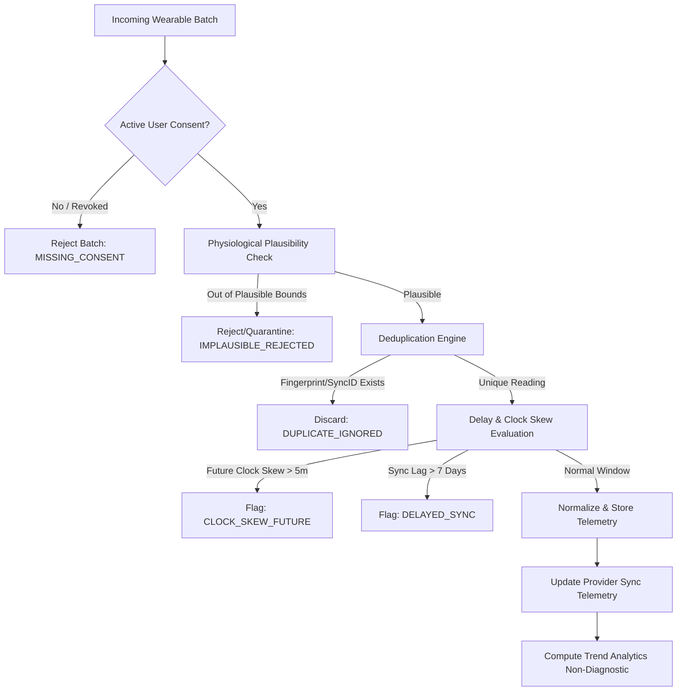

# Health Vibe AI - Wearable & Health Telemetry Integration Architecture
## Multi-Platform Ingestion: Apple Health, Health Connect, Smartwatches & Continuous Monitors

---

### 1. Executive Summary & Clinical Governance Boundary

The Health Vibe AI **Wearable Integration Layer** provides a normalized, privacy-preserving, and fault-tolerant pipeline for ingesting longitudinal **Blood Pressure** and **Blood Glucose** telemetry from consumer and medical-grade connected devices.

> [!IMPORTANT]
> **Strict Clinical Governance Invariant**:
> **Wearable telemetry is strictly observational.** The integration layer computes rolling trends, time-in-range, and diurnal patterns to inform patient-physician clinical discussions. **Under no circumstances does wearable telemetry automatically generate a diagnostic conclusion or modify prescription dosages/medication regimens.**

---

### 2. Supported Platforms, Providers & Device Ecosystems

| Platform / Provider | Protocols / SDK | Target Hardware Ecosystem | Supported Health Metrics |
| :--- | :--- | :--- | :--- |
| **Apple Health (HealthKit)** | `HealthKit.framework` (iOS/watchOS) | Apple Watch Series 4-10/Ultra, Connected BLE Monitors (Withings, Omron, Qardio) | - `HKQuantityTypeIdentifierBloodPressureSystolic`<br>- `HKQuantityTypeIdentifierBloodPressureDiastolic`<br>- `HKQuantityTypeIdentifierBloodGlucose` |
| **Health Connect (Google/Android)** | `androidx.health.connect:connect-client` | Pixel Watch 1-3, Samsung Galaxy Watch 4-7, Wear OS 3+, Android OS 14+ | - `BloodPressureRecord` (systolic, diastolic, bodyPosition, measurementLocation)<br>- `BloodGlucoseRecord` (level, mealType, specimenSource) |
| **Smartwatch Direct APIs** | OAuth 2.0 Cloud Webhooks & Direct BLE | Garmin Health API, Fitbit/Google Web API, Withings Health Mate Cloud | Heart rate, blood pressure cuffs, continuous/intermittent glucose monitors |
| **Continuous Glucose Monitors (CGM)** | Apple Health / Health Connect Shared Records | Dexcom G6/G7, Abbott FreeStyle Libre 2/3 (via HealthKit/Health Connect sync) | Intermittent and real-time interstitial glucose telemetry |

---

### 3. Unified Telemetry Data Schema

Every ingested reading is normalized into a vendor-agnostic schema with full provenance tracking:

```json
{
  "readingId": "wearable_read_9827361_a8f9",
  "patientId": "usr_patient_hossam_45",
  "metricType": "BLOOD_PRESSURE",
  "value": {
    "systolic": 128,
    "diastolic": 82,
    "pulse": 72
  },
  "unit": "mmHg",
  "deviceTimestamp": "2026-10-02T08:15:00.000Z",
  "ingestionTimestamp": "2026-10-02T08:16:30.000Z",
  "syncDelaySeconds": 90,
  "device": {
    "manufacturer": "Apple",
    "model": "Apple Watch Series 9",
    "hardwareRevision": "Watch7,4",
    "firmwareVersion": "11.0",
    "identifier": "masked_dev_c819"
  },
  "readingSource": "APPLE_HEALTH",
  "sourceSyncId": "hk_sample_9812-3841-ab",
  "userConsent": {
    "consented": true,
    "consentTimestamp": "2026-10-01T12:00:00.000Z",
    "scopes": ["read_blood_pressure", "read_blood_glucose"],
    "version": "v1.0"
  },
  "qualityStatus": {
    "status": "VALID",
    "flags": [],
    "isDuplicate": false,
    "isPlausible": true,
    "syncDelayCategory": "REAL_TIME"
  }
}
```

#### Glucose Telemetry Specific Schema
```json
{
  "metricType": "BLOOD_GLUCOSE",
  "value": {
    "bloodGlucose": 118,
    "bloodGlucoseMmol": 6.55,
    "mealContext": "fasting",
    "specimenSource": "interstitial_fluid"
  },
  "unit": "mg/dL"
}
```
*Note: The system standardizes internally on `mg/dL` while maintaining exact `mmol/L` equivalents (`1 mmol/L = 18.018 mg/dL`) for international clinicians.*

---

### 4. Data Ingestion Quality & Safety Pipeline



#### 4.1. Physiological Plausibility Thresholds
Readings falling outside human physiological limits are quarantined or rejected to prevent corrupted wearable sensor noise from contaminating charts:

- **Blood Pressure Plausibility**:
  - Systolic: $60\text{ mmHg} \le \text{sys} \le 260\text{ mmHg}$
  - Diastolic: $35\text{ mmHg} \le \text{dia} \le 160\text{ mmHg}$
  - Differential: $\text{sys} - \text{dia} \ge 10\text{ mmHg}$ (systolic must strictly exceed diastolic)
  - Pulse / Heart Rate: $35\text{ bpm} \le \text{pulse} \le 230\text{ bpm}$
- **Blood Glucose Plausibility**:
  - Interstitial / Capillary Glucose: $25\text{ mg/dL} \le \text{glucose} \le 550\text{ mg/dL}$ ($1.4\text{ mmol/L} \le \text{glucose} \le 30.5\text{ mmol/L}$)

#### 4.2. Deduplication Engine (Fingerprint & Sync ID)
Devices repeatedly sync overlapping time windows (e.g. Apple HealthKit queries fetching last 7 days). The deduplication engine guarantees idempotency through:
1. **Source Sync ID**: External UUID (e.g. `HKQuantitySample.uuid`, Health Connect `metadata.id`).
2. **Deterministic Fingerprint**: If source ID is absent:
   $$\text{Fingerprint} = \text{SHA256}(\text{patientId} + \text{metricType} + \text{deviceTimestampRoundedToMinute} + \text{numericValue})$$

#### 4.3. Delay & Disconnection Handling
- **Delay Categories**:
  - `REAL_TIME`: Ingested within 15 minutes of measurement.
  - `DELAYED_SYNC`: Ingested between 15 minutes and 7 days.
  - `STALE_BACKLOG`: Ingested $> 7\text{ days}$ after measurement (flagged with backfill warning).
  - `FUTURE_CLOCK_SKEW`: Ingested timestamp is $> 5\text{ minutes}$ ahead of server UTC (device clock desynchronized).
- **Connection Lifecycle States**:
  - `CONNECTED`: Active token/permission; healthy sync within last 24 hours.
  - `SYNCING`: Active sync job in progress.
  - `DISCONNECTED`: User manually revoked connection or uninstalled integration.
  - `TOKEN_EXPIRED`: OAuth token requires re-authorization.
  - `PERMISSION_REVOKED`: OS-level permission denied in iOS Settings or Android Health Connect.
  - `SYNC_ERROR`: Transient network or cloud provider failure.

---

### 5. Wearable Trends & Non-Diagnostic Clinical Boundaries

Wearable trends are computed to help clinicians and patients observe patterns over 7, 14, or 30 days:

1. **Blood Pressure Trends**:
   - 7-day and 14-day rolling mean systolic and diastolic.
   - Diurnal morning vs. evening systolic variation.
   - Percentage of readings within target guideline ($< 130/80\text{ mmHg}$).
2. **Glucose Trends**:
   - Time-in-Range (TIR): % readings between $70\text{ mg/dL}$ and $180\text{ mg/dL}$ ($3.9 - 10.0\text{ mmol/L}$).
   - Time-Below-Range (TBR): % readings $< 70\text{ mg/dL}$.
   - Time-Above-Range (TAR): % readings $> 180\text{ mg/dL}$.
   - Estimated Glucose Management Indicator (eGMI) calculation for longitudinal review.

> [!CAUTION]
> **Clinical Non-Diagnostic Disclaimer**:
> Every trend payload and user interface response includes:
> ```json
> {
>   "isDiagnosticDecision": false,
>   "clinicalDisclaimer": "Wearable trends are observational and intended for clinical discussion with an attending physician. Wearable readings do not replace certified medical equipment and cannot be used to autonomously modify prescription regimens or diagnose disease."
> }
> ```
