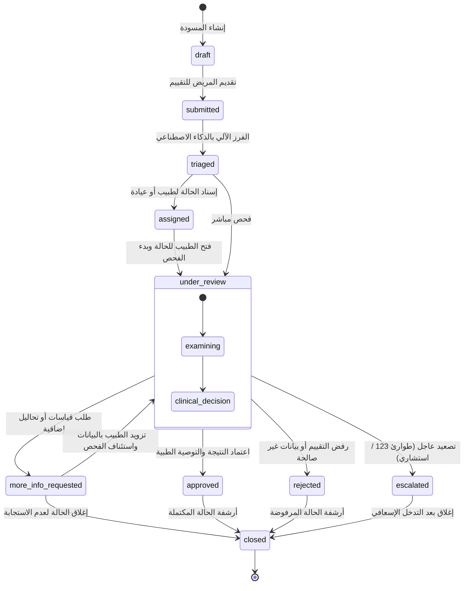

# Health Vibe AI - مواصفات مخطط التقييم السريري (Clinical Assessment Schema v1.0.0)

## 📌 الهدف والمبدأ الأساسي
توحيد بيانات التقييم التنفسي والسريري في مخطط بيانات (**Schema**) واضح، ثابت، ومحكم بين:
1. **واجهة العميل (Patient App / Frontend)** أثناء جمع الأعراض والقياسات.
2. **قواعد أمان Firestore (Security Rules)** للتأكد من عدم التلاعب بهوية المريض أو الطبيب المسند.
3. **طبقة الخادم والذكاء الاصطناعي (Backend API / Cloud Functions)** للفرز السريري والاعتماد.
4. **سجل التدقيق (Audit Log)** للامتثال للمعايير الطبية.

---

## 📐 هيكلية وثيقة الحالة والتقييم (`cases/{caseId}`)

```json
{
  "schemaVersion": "1.0.0",
  "caseId": "case_987654",
  "patientId": "usr_patient_abc123",
  "patientEmail": "patient@example.com",
  "patientName": "أحمد محمد",
  "patientNameEn": "Ahmed Mohamed",
  "assignedDoctorId": "usr_doctor_xyz789",
  "assignedDoctorName": "د. منى سامي",
  "clinicId": "clinic_cairo_nasr_city",
  "clinicName": "عيادة مدينة نصر",
  "status": "pending",

  "privacyConsent": {
    "accepted": true,
    "version": "HealthVibe-Privacy-v1.0",
    "acceptedAt": "2026-09-21T00:00:00.000Z",
    "dataProcessing": true,
    "aiAdvisory": true,
    "notifications": false
  },

  "assessment": {
    "vitals": {
      "oxygenLevel": 95,
      "isLowOxygen": false,
      "isCriticalOxygen": false,
      "unit": "%"
    },
    "symptoms": {
      "breathingDifficulty": "no",
      "breathingDifficultyLabelAr": "لا (تنفس طبيعي)",
      "breathingDifficultyLabelEn": "No (Normal breathing)",
      "coughSeverity": "moderate",
      "coughSeverityLabelAr": "متوسطة",
      "coughSeverityLabelEn": "Moderate",
      "durationDays": 3,
      "durationText": "3 أيام",
      "durationTextEn": "3 days"
    },
    "riskFactors": {
      "keys": ["asthma"],
      "labelsAr": ["ربو"],
      "labelsEn": ["Asthma"]
    },
    "aiTriage": {
      "priority": "normal",
      "priorityLabelAr": "عادية",
      "risk": "منخفض",
      "riskEn": "Low",
      "aiScore": "منخفضة",
      "aiScoreEn": "Low",
      "ruleScore": "low-rule-match",
      "ruleScoreLabelAr": "مؤشر قواعد منخفض",
      "ruleScoreLabelEn": "Low rule score",
      "ruleScorePoints": 1,
      "triggeredRules": [
        {
          "id": "moderate_cough",
          "points": 1,
          "ar": "كحة متوسطة",
          "en": "Moderate cough",
          "version": "HealthVibe-Rules-v1.0"
        }
      ],
      "ruleSetId": "breathing-triage",
      "ruleEngineVersion": "HealthVibe-Rules-v1.0",
      "ruleEngineEffectiveFrom": "2026-09-21",
      "ruleEngineReviewStatus": "clinician-reviewed-rules",
      "ruleScoreValidated": false,
      "confidence": "not-validated-rule-score",
      "modelVersion": "HealthVibe-AI-v1.0"
    }
  },

  "oxygenLevel": 95,
  "o2": 95,
  "breathingDifficulty": "لا (تنفس طبيعي)",
  "coughLevel": "متوسطة",
  "symptomDuration": "3 أيام",
  "duration": "3 أيام",
  "durationEn": "3 days",
  "riskFactors": ["ربو"],
  "symptoms": "كحة متوسطة",
  "symptomsEn": "Moderate cough",
  "priority": "normal",
  "risk": "منخفض",
  "riskEn": "Low",
  "aiScore": "منخفضة",
  "aiScoreEn": "Low",
  "ruleScore": "low-rule-match",
  "ruleScoreLabelAr": "مؤشر قواعد منخفض",
  "ruleScoreLabelEn": "Low rule score",
  "ruleScorePoints": 1,
  "triggeredRules": [
    {
      "id": "moderate_cough",
      "points": 1,
      "ar": "كحة متوسطة",
      "en": "Moderate cough",
      "version": "HealthVibe-Rules-v1.0"
    }
  ],
  "ruleSetId": "breathing-triage",
  "ruleEngineVersion": "HealthVibe-Rules-v1.0",
  "ruleEngineEffectiveFrom": "2026-09-21",
  "ruleEngineReviewStatus": "clinician-reviewed-rules",
  "ruleScoreValidated": false,
  "confidence": "not-validated-rule-score",
  "reportVersion": "1.0.0",
  "modelVersion": "HealthVibe-AI-v1.0",
  "generatedAt": null,
  "approvedAt": null,

  "submittedAt": "2026-09-21T00:00:00.000Z",
  "reviewedBy": null,
  "reviewedAt": null,
  "doctorNotes": null,
  "doctorNote": null,
  "clinicalNotes": null,
  "recommendation": null,
  "recommendations": [],
  "approvingDoctorId": null,
  "approvingDoctorEmail": null,
  "result": null,

  "statusHistory": [
    {
      "status": "pending",
      "previousStatus": null,
      "changedAt": "2026-09-21T00:00:00.000Z",
      "changedBy": "patient_uid_12345",
      "changedByName": "أحمد محمد",
      "changedByEmail": "patient@example.com",
      "changedByRole": "patient",
      "note": "Initial assessment submission"
    },
    {
      "status": "approved",
      "previousStatus": "pending",
      "changedAt": "2026-09-21T01:15:00.000Z",
      "changedBy": "doctor_uid_67890",
      "changedByName": "د. منى سامي",
      "changedByEmail": "dr.mona@hospital.eg",
      "changedByRole": "doctor",
      "note": "تمت المراجعة والاعتماد السريري من الطبيب"
    }
  ]
}
```

---

## 🔍 تفصيل الحقول والأنواع المسموحة (Field Types & Validations)

### 0. الموافقة الطبية وسياسة الخصوصية (`privacyConsent` / `assessment.privacyConsent`):
* شرط إلزامي مسبق (`Privacy Consent Gate`): لا يمكن بدء أو إرسال تقييم التنفس بدون تأكيد الموافقة مسبقاً، وتُسجل قبل كائن التقييم السريري (`assessment`).
* `accepted`: قيمة بوليان إجبارية (`true`) تؤكد موافقة المريض الصريحة على معالجة البيانات السريرية والطبيعة الإرشادية للفرز الذكي.
* `version`: إصدار ميثاق الخصوصية وقت الموافقة (مثال: `"HealthVibe-Privacy-v1.0"`).
* `acceptedAt`: التوقيت الزمني لتوثيق الموافقة بصيغة ISO-8601 UTC.
* `dataProcessing`: قيمة بوليان (`true`) للموافقة على معالجة البيانات ومشاركتها مع الطبيب المعالج المعتمد.
* `aiAdvisory`: قيمة بوليان (`true`) للإقرار بالطبيعة الإرشادية لأدوات الذكاء الاصطناعي.
* `notifications`: قيمة بوليان اختيارية لتلقي تحديثات الحالة وإشعارات المراجعة الطبية.

### 1. المؤشرات الحيوية (`assessment.vitals`):
* `oxygenLevel`: رقم صحيح موجب (`0` إلى `100`).
* `isLowOxygen`: بوليان (`true` إذا كانت نسبة الأكسجين `< 93%`).
* `isCriticalOxygen`: بوليان (`true` إذا كانت نسبة الأكسجين `< 90%`).
* `unit`: نص ثابت `"%"`

### 2. الأعراض السريرية (`assessment.symptoms`):
* `breathingDifficulty`: قائمة خيارات مغلقة (`"yes"` | `"no"`).
* `coughSeverity`: قائمة خيارات مغلقة (`"none"` | `"mild"` | `"moderate"` | `"severe"`).
* `durationDays`: عدد الأيام كقيمة عددية صحيحة للتصنيف الإحصائي.
* `durationText`: نص تمثيل المدة بالعربية (مثل: `"3 أيام"`).

### 3. عوامل الخطورة (`assessment.riskFactors`):
* `keys`: مصفوفة من القيم المعيارية الموحدة:
  * `"asthma"` (ربو)
  * `"smoking"` (تدخين)
  * `"pregnancy"` (حمل)
  * `"none"` (لا يوجد)

### 4. الفرز الذكي والتصنيف السريري (`assessment.aiTriage`):
* `priority`:
  * `"urgent"`: أكسجين أقل من 90%، يحتاج تدخلاً فورياً.
  * `"high"`: أكسجين بين 90% و 92%، أولوية مراجعة عالية.
  * `"normal"`: أكسجين 93% فأعلى، فحص اعتيادي تحت المراجعة.
* `ruleScore`: مؤشر قواعد إرشادي مبني على شروط ثابتة، وليس ثقة نموذج مُتحقق منها سريرياً.
* `ruleScorePoints`: مجموع نقاط القواعد المفعلة داخل محرك الفرز.
* `triggeredRules`: القواعد السريرية التي تسببت في التصنيف، مع النص العربي والإنجليزي والنقاط وإصدار القاعدة وقت التقييم.
* `ruleSetId`: معرف مجموعة القواعد المستخدمة، مثل `"breathing-triage"`، لتمييز مسارات فرز مختلفة مستقبلاً.
* `ruleEngineVersion`: إصدار محرك القواعد المستخدم.
* `ruleEngineEffectiveFrom`: تاريخ بدء العمل بهذه النسخة من القواعد.
* `ruleEngineReviewStatus`: يوضح أن القواعد مصممة لتكون قابلة لمراجعة الطبيب (`"clinician-reviewed-rules"`)، وليست نموذجاً إحصائياً مُتحققاً.
* `ruleScoreValidated`: قيمة ثابتة `false` حتى يتم اعتماد تحقق سريري رسمي لهذا المؤشر.
* `confidence`: حقل توافق قديم، ويجب ألا يحتوي نسبة مئوية أو يُعرض كثقة طبية؛ قيمته الحالية `"not-validated-rule-score"`.
* `modelVersion`: إصدار خوارزمية التقييم.

#### سياسة Versioning لقواعد الخطورة ومحرك الفرز
* **مبدأ الثبات وعدم التعديل الرجعي (Clinical Immutability Guarantee)**:
  * كل حالة يتم تقييمها تحتفظ بنسخة القواعد التي أنتجت التقييم (`ruleSetId` و`ruleEngineVersion` و`ruleEngineEffectiveFrom`) داخل الوثيقة بشكل دائم وغير قابل للتعديل الرجعي.
  * عند قيام الطبيب بمراجعة حالة تاريخية أو إصدار تقرير معتمد لها، يتم استدعاء وعرض القواعد الأصلية التي تسببت في التصنيف، وليس القواعد النشطة حالياً.
* **سجل إصدارات القواعد (Risk Rulesets Registry)**:
  * يحتوي النظام على سجل معتمد (`RISK_RULESETS_REGISTRY`) يوثق تاريخ كل إصدار، حالته السريرية (`active` | `candidate` | `deprecated`)، تاريخ سريانه، الجهة المعتمدة، وسجل التغييرات (`changelog`).
  * تتوفر مواصفات القواعد عبر مسار الخادم: `GET /api/clinical/rules/versions`.
* `triggeredRules[].version` يسجل إصدار كل قاعدة مفعلة وقت التقييم الفعلي.

#### مواصفات الإصدارات المسجلة:

##### 1. `HealthVibe-Rules-v1.0` (الإصدار النشط المعتمد - Baseline Active)
* **تاريخ السريان**: 2026-09-21
* **الحالة**: `active` (Clinician-Reviewed)
* **القواعد ونقاط الفرز**:
  * `spo2_lt_90` (SpO2 < 90%): +6 نقاط (تصعيد عاجل للطوارئ).
  * `spo2_90_92` (SpO2 90-92%): +4 نقاط (أولوية مراجعة عالية).
  * `spo2_93_94` (SpO2 93-94%): +2 نقاط (متابعة قريبة).
  * `dyspnea_present` (وجود ضيق تنفس): +2 نقاط.
  * `severe_cough` (كحة شديدة): +2 نقاط.
  * `moderate_cough` (كحة متوسطة): +1 نقطة.
  * `symptoms_7_days` (استمرار الأعراض 7 أيام أو أكثر): +1 نقطة.
  * `risk_factors_present` (وجود عوامل خطورة مسجلة): +1 نقطة.
* **عتبات التصنيف النهائي**:
  * **عاجل (Urgent)**: عند `SpO2 < 90%` أو مجموع نقاط `6+`.
  * **عالي (High)**: عند `SpO2 < 93%` أو مجموع نقاط `3+`.
  * **عادي (Normal)**: ما دون ذلك.

##### 2. `HealthVibe-Rules-v1.1` (الإصدار المرتقب - Candidate Release)
* **تاريخ السريان**: 2026-10-01
* **الحالة**: `candidate` (Under Pulmonology Review)
* **سجل التغييرات**: تعزيز حساسية عوامل الخطورة التنفسية المزمنة ومضاعفة وزنها السريري إلى (+2 نقاط) مع تفصيل تمييز ضيق التنفس الحاد.

### 5. بيانات إصدار التقرير (`Report Metadata`):
* `reportVersion`: إصدار قالب التقرير الطبي المعتمد.
* `modelVersion`: إصدار نموذج الفرز المستخدم لإنتاج التقييم.
* `generatedAt`: تاريخ ووقت إنشاء التقرير النهائي، ويُسجل عند اعتماد الطبيب.
* `approvedAt`: تاريخ ووقت اعتماد الطبيب للتقرير النهائي.

### 6. مخرجات مراجعة الطبيب (`Doctor Review Output`):
* `doctorNote` / `clinicalNotes`: ملاحظات الطبيب السريرية الحقيقية المكتوبة قبل الاعتماد.
* `recommendations`: قائمة توصيات الطبيب للمريض، وتُكتب كتوصية واحدة على الأقل قبل اعتماد التقرير.
* `recommendation`: نسخة نصية متوافقة للخلف من التوصيات، مفصولة بأسطر.

### 7. سجل دورة حياة الحالة والتدقيق (`statusHistory`):
* مصفوفة متراكمة تسجل كل انتقال في حالة الفحص السريري:
  * `status`: الحالة الجديدة (`"pending"` | `"approved"` | `"rejected"` | `"under_review"`).
  * `previousStatus`: الحالة السابقة.
  * `changedAt`: تاريخ وتوقيت التغيير بصيغة ISO-8601 UTC.
  * `changedBy`: معرّف المستخدم المنفذ للإجراء (`uid`).
  * `changedByName`: الاسم الظاهر للمستخدم (طبيب، مريض، أو إدارة).
  * `changedByEmail`: البريد الإلكتروني الموثق.
  * `changedByRole`: دور المستخدم (`"patient"` | `"doctor"` | `"admin"`).
  * `note`: ملاحظة أو تعليق مصاحب للانتقال.

---

## 🛡️ مصفوفة التحقق الإلزامي الشامل (Comprehensive Validation Matrix)

| الحقل السريري | النوع والمدى المقبول | شروط التحقق في الواجهة (Client Validation) | قواعد أمان الخادم (Firestore Rules) |
| :--- | :--- | :--- | :--- |
| **`oxygenLevel` / `o2`** | رقم صحيح `50 - 100` | حظر القيم خارج النطاق، تمييز الحقل بالأحمر، ومنع الإرسال | `isValidOxygen`: حظر أي قيمة خارج `[50, 100]` بـ `permission-denied` |
| **`breathingDifficulty`** | خيار إلزامي من `["نعم", "لا", "yes", "no"]` | منع قيمة "غير محدد" وإلزام المستخدم بتحديد الحالة | `isValidBreathing`: التأكد من وجود نص صحيح محدد |
| **`coughSeverity`** | خيار إلزامي من `["خفيفة", "متوسطة", "شديدة", "لا توجد"]` | إلزام المستخدم باختيار درجة الكحة بدقة | `isValidCough`: التأكد من نص شدة كحة صحيح |
| **`symptomDuration`** | نص يحتوي على عدد أيام بين `1` و `365` | حظر القيم الصفرية، السالبة، أو غير المحددة أو التي تزيد عن 365 يوماً | `isValidDuration`: نص غير فارغ محدد الطول |
| **`riskFactors`** | مصفوفة غير فارغة بعوامل مصرح بها | التحقق من الخيارات المصرح بها أو اختيار "لا يوجد" | `isValidRiskFactors`: مصفوفة لا تتجاوز 10 عناصر |
| **`priority`** | أحد الخيارات: `["normal", "high", "urgent"]` | حساب آلي يعتمد على نسبة الأكسجين والأعراض | `isValidPriority`: التحقق الصارم من صحة التصنيف |
| **`status`** | إحدى الحالات العشر المعتمدة في آلة الحالات | إدارة انتقالات الحالة حسب الصلاحيات السريرية | `isValidCaseStatus`: التحقق الصارم من صحة الحالة والانتقال |
| **`statusHistory`** | مصفوفة سجلات تاريخ الحالة | حفظ تراكمي غير قابل للحذف عند كل انتقال | `isValidStatusHistory`: مصفوفة لا تتجاوز 50 سجلاً |
| **`patientId`** | معرّف مشفر يطابق `auth.uid` | ربط أوتوماتيكي بالمستخدم المسجل | `request.resource.data.patientId == request.auth.uid` غير قابل للتغيير |
| **`assignedDoctorId`** | معرّف طبيب مسجل أو `null` | يحدد تلقائياً أو عبر الإدارة | غير قابل للتعديل من قبل الأطباء (`immutable`) لمنع الاستيلاء على الحالات |
| **`clinicId`** | معرّف عيادة صالح | يحدد تلقائياً أو عبر الإدارة | غير قابل للتعديل من قبل الأطباء لمنع نقل الحالات بين الفروع |

---

## 🔄 آلة الحالات السريرية المعتمدة (Clinical Case State Machine)

تعتمد المنصة دورة حياة سريرية صارمة تخضع لمبدأ التحقق الصفري (**Zero-Trust State Machine**):



### جدول مصفوفة الانتقالات والصلاحيات (State Transition Matrix)

| الحالة الحالية | الحالات التالية المسموحة | الجهة المخولة (Authorized Actor) | الغرض السريري والإجراء المصاحب |
| :--- | :--- | :--- | :--- |
| **`draft`** | `submitted` | المريض (`patient`) | إرسال التقييم بعد اكتمال المدخلات وتأكيد المريض |
| **`submitted`** | `triaged` | نظام الذكاء الاصطناعي (`system`) | احتساب أولوية الخطورة والفرز السريري الأوتوماتيكي |
| **`triaged`** | `assigned` | مسؤول العيادة (`admin`) / التوجيه الآلي | ربط الحالة بالطبيب المختص في الفرع |
| **`assigned`** | `under_review` | الطبيب المسند (`doctor`) | انتقال تلقائي فور فتح الطبيب للحالة في لوحة المراجعة |
| **`under_review`** | `approved` | الطبيب المسند (`doctor`) | اعتماد النتيجة وحفظ التوصيات السريرية |
| **`under_review`** | `more_info_requested` | الطبيب المسند (`doctor`) | طلب إعادة قياس SpO2 أو رفع تقرير سابق |
| **`under_review`** | `escalated` | الطبيب المسند (`doctor`) | إشعار فوري بحالة طوارئ تنفسية وتوجيه للإسعاف |
| **`under_review`** | `rejected` | الطبيب المسند (`doctor`) | رفض تقييم مكرر أو بيانات غير طبية |
| **`under_review`** | `closed` | الطبيب المسند (`doctor`) / الإدارة | إنهاء مراجعة الحالة وأرشفتها |
| **`more_info_requested`** | `under_review` | المريض / الطبيب | استئناف الفحص بعد إدراج البيانات المطلوبة |
| **`approved`** | `closed` | الطبيب / الإدارة | إغلاق وأرشفة الحالة المعتمدة |
| **`rejected`** | `closed` | الطبيب / الإدارة | أرشفة الحالة المرفوضة |
| **`escalated`** | `under_review` / `closed` | الطبيب الاستشاري / الإدارة | إعادة تقييم سريري أو إغلاق بعد تلقي الرعاية الإسعافية |

---

## 🔒 التوافقية والأمان (Backward Compatibility & Security)
* **دعم الواجهات السابقة (Top-Level Aliases)**:
  تم الحفاظ على الحقول السطحية مثل `o2`, `risk`, `symptoms`, `aiScore`, `confidence`, `duration` لضمان عمل كافة الشاشات والقوائم السابقة دون أدنى كسر توافقي، بالإضافة لدعم الاسم الرديف `pending` في قواعد الأمان.
* **ثبات الهوية (Immutability)**:
  تمنع قواعد أمان Firestore أي تعديل لحقول `patientId` أو `assignedDoctorId` أو `clinicId` عند تحديث الحالة الطبية من قبل الأطباء.
* **أصالة وتتبع الحالة (Audit & Traceability)**:
  حفظ مصفوفة `statusHistory` التراكمية يمنع التلاعب بأصل الحالات ويوثق بدقة من قام بمراجعة أو اعتماد كل حالة وفي أي وقت مع حفظ الملاحظات السريرية المقترنة في كل خطوة.
