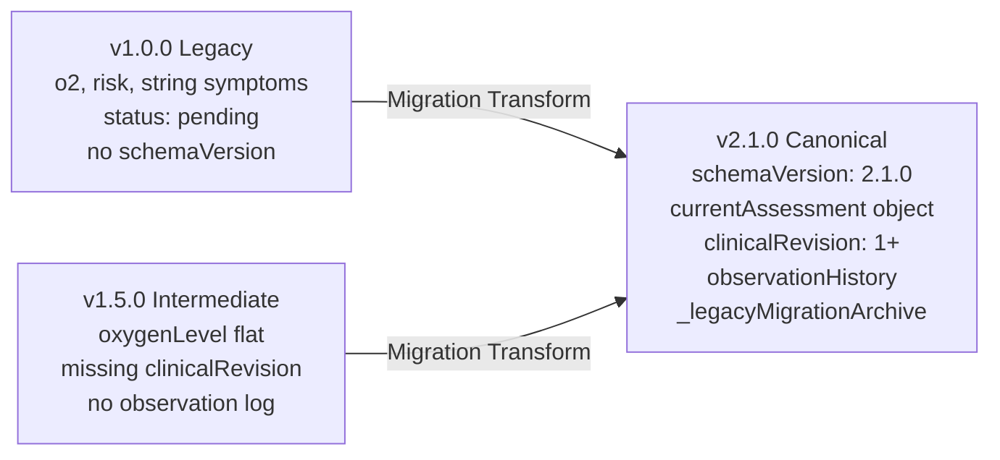

# Health Vibe AI - Versioned Data Migration & Integrity Guide (v2.1.0)

## 📌 1. Purpose & Core Principles
This document outlines the data integrity verification, schema evolution, and migration procedures across Health Vibe AI's clinical entities (`cases`, `clinical_reports`, `users`, `appointments`).

### Non-Negotiable Clinical Governance Principles:
1. **Never Invent Clinical Facts**:
   - If an older assessment record lacks a physiological parameter (e.g., body temperature, blood pressure, or respiratory rate), the migration engine **NEVER** fabricates or assumes a normal default (such as 37.0°C or 120/80 mmHg).
   - Missing fields remain explicitly `null` / unrecorded.
2. **Preserve Historical Fidelity**:
   - Every original, unmigrated document is captured verbatim into `_legacyMigrationArchive.originalRawFields` before transformation. No historical observation, timestamp, or raw input is ever overwritten or lost.
3. **Strict Idempotency**:
   - Executing the migration repeatedly on the same record produces the exact same state without drift, duplicate observations, or artificial revision increments.
4. **Resumability & Checkpointing**:
   - Batch executions save persistent checkpoints (`chk_<collection>`) recording the last processed index, enabling instantaneous recovery from the exact point of interruption during transient network or infrastructure pauses.
5. **Read-Only Dry Run Guarantee**:
   - Production migrations must always be preceded by a zero-write dry run providing aggregate counts and PII-redacted diagnostics.

---

## 🗂️ 2. Schema Evolution & Version Taxonomy



### Schema Comparison Matrix:
| Field / Concept | Legacy `v1.0.0` | Intermediate `v1.5.0` | Canonical `v2.1.0` | Migration Transformation |
| :--- | :--- | :--- | :--- | :--- |
| `schemaVersion` | Missing or `'1.0'` | `'1.5.0'` | `'2.1.0'` | Upgraded to `'2.1.0'` |
| `clinicalRevision` | Missing | Missing or `null` | Integer $\ge 1$ | Set to `1` (or existing integer) |
| `o2` / `oxygenLevel` | Flat `o2: 95` | Flat `oxygenLevel: 95` | `currentAssessment.oxygenLevel` | Canonicalized in `currentAssessment`, top-level `o2` & `oxygenLevel` aliases preserved |
| `temperature` | Usually omitted | Flat `temperature: null` | `currentAssessment.temperature` | **Preserved as `null` if omitted. Never invented.** |
| `systolicBp` / `diastolicBp` | Usually omitted | Usually omitted | `currentAssessment.systolicBp` | **Preserved as `null` if omitted. Never invented.** |
| `symptoms` | String or Array | Array | Array of Strings | Comma/semicolon-separated string parsed into trimmed string array |
| `status` | `'pending'` | `'submitted'` | `'submitted'` | Legacy `'pending'` normalized to `'submitted'` |
| `triageLevel` | Flat `risk: 'moderate'` | `triageLevel: 'moderate'` | `triageLevel: 'moderate'` | Mapped from `risk` (`low`, `moderate`, `high`) |
| `observationHistory`| Missing | Missing | Array of Observations | Initial baseline observation synthesized with cycle `0` |
| `_legacyMigrationArchive` | Missing | Missing | Immutable Snapshot | Captures full original raw record and version |

---

## 🔍 3. Integrity Diagnostics & Inconsistency Detection

The diagnostic engine checks each record against four failure modes:
1. **Inconsistent Legacy Fields**:
   - Detects flat `o2` without structured `currentAssessment.oxygenLevel`.
   - Detects raw string symptoms requiring array normalization.
   - Normalizes legacy `risk` strings into standard `triageLevel`.
2. **Missing References (Foreign Key Integrity)**:
   - Verifies `patientId` exists in the user registry.
   - Verifies `assignedDoctorId` exists in doctor application or user registry.
3. **Orphaned Records**:
   - Identifies clinical reports whose `caseId` references a deleted or non-existent case.
   - Identifies appointments with dead references.
4. **Unsupported or Corrupt Schema Versions**:
   - Flags corrupt versions, negative revisions, or unrecognized statuses for manual review.

---

## ⚙️ 4. Read-Only Dry Run & PII Redaction

Before executing any database writes, run:
```bash
node backend/scripts/run-migration.js --dry-run
```

### PII Redaction Rules in Dry Run Reports:
- **Names**: `Tarek Abdel-Moneim` $\to$ `T***m`
- **Emails**: `patient@example.com` $\to$ `p***@***.com`
- **National IDs**: `28406120102931` $\to$ `2840******31`
- **Phone Numbers**: `01012345678` $\to$ `010****78`

---

## 🔄 5. Resumable Batch Migration & Checkpointing Engine

Execute live migration in controlled, stateful batches:
```bash
node backend/scripts/run-migration.js --live --batch-size=50
```

### Checkpoint Lifecycle:
1. **Batch Execution**:
   - The engine slices documents into chunks of size `batchSize` (default: 50).
   - Each chunk transforms documents idempotently.
2. **Checkpoint Stamping**:
   - Upon successful commit of a batch, a checkpoint record is written:
     ```json
     {
       "checkpointId": "chk_cases_1",
       "runId": "mig_run_cases_1727880000000",
       "batchNumber": 1,
       "lastProcessedIndex": 49,
       "lastProcessedId": "case_1049",
       "completedCount": 50,
       "status": "in_progress"
     }
     ```
3. **Resume on Interruption**:
   - If an unhandled transient failure or server restart occurs during batch 3, restarting with `--resume` inspects the checkpoint and begins at index 100 with zero duplicate writes or skips.

---

## ⏪ 6. Rollback & Recovery Procedures

If a migration run must be reverted:
1. **Document-Level Rollback**:
   - Every migrated document contains `_legacyMigrationArchive.originalRawFields`.
   - The rollback routine retrieves `originalRawFields` and restores the document to its pre-migration structure with 100% exact fidelity.
2. **Batch Rollback**:
   ```bash
   node backend/scripts/run-migration.js --rollback
   ```
3. **Audit Verification**:
   - A `MIGRATION_BATCH_ROLLED_BACK` audit entry is recorded with the count of reverted documents and timestamp.
