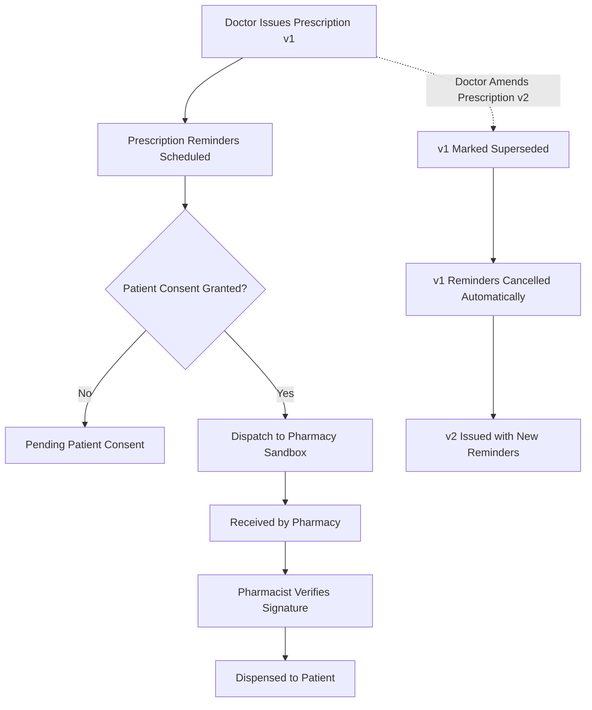

# Health Vibe AI - Pharmacy Integration Contract & Governance Specification (v1.0.0-sandbox)

## 📌 1. Purpose & Clinical Governance
This contract specifies the electronic prescription transmission standard between **Health Vibe AI** and accredited partner pharmacy dispensing systems.

### Core Operating Principles:
1. **Prescriber Authority**:
   - Only an approved, licensed physician with verified credentials can create, sign, and issue an electronic prescription.
2. **Strict Digital Signature**:
   - Every prescription payload is cryptographically sealed using HMAC-SHA256 with physician license stamping. Any payload tampering automatically invalidates dispensing.
3. **Explicit Patient Consent**:
   - Data transmission to pharmacy partners requires explicit patient opt-in consent (`PHARMACY_CONSENT_REQUIRED`). Data cannot be transferred without valid consent.
4. **Prescription Reminders Safeguard**:
   - Patient reminders strictly remind them of the prescribed medication, dose, and frequency.
   - **Alternative Treatment Prohibition**: Under no circumstances may generic switches or alternative therapies be suggested to patients without explicit doctor re-prescription.
5. **Sandbox Isolation**:
   - Until accredited pharmacy partnerships, HIPAA/MOH audits, and clinical pilot reviews are ratified, all pharmacy dispatches execute in **Sandbox Mode** (`PHARMACY_INTEGRATION_MODE = 'sandbox'`).

---

## 📐 2. Contract Payload Specification (`v1.0.0-sandbox`)

### JSON Transmission Schema:
```json
{
  "contractVersion": "1.0.0-sandbox",
  "mode": "sandbox",
  "transmissionId": "trans_rx_case_123_v1_1727870000000",
  "transmissionTimestamp": "2026-10-02T12:00:00.000Z",
  "pharmacyId": "pharmacy_partner_cairo_central",
  "patient": {
    "patientId": "usr_patient_abc123",
    "name": "أحمد محمود"
  },
  "prescription": {
    "prescriptionId": "rx_case_123_v1_1727870000000",
    "version": 1,
    "issuedAt": "2026-10-02T11:58:00.000Z",
    "medications": [
      {
        "id": "rx_item_1",
        "name": "Salbutamol Inhaler",
        "dosage": "100 mcg",
        "duration": "7 days",
        "frequency": "When needed / Every 6 hours",
        "instructions": "Inhale 2 puffs as directed during acute shortness of breath."
      }
    ],
    "digitalSignature": {
      "algorithm": "HMAC-SHA256",
      "signatureHash": "e3b0c44298fc1c149afbf4c8996fb92427ae41e4649b934ca495991b7852b855",
      "signedBy": "د. منى سامي",
      "doctorLicense": "HV-MD-LIC-20491",
      "signedAt": "2026-10-02T11:58:00.000Z"
    }
  },
  "prescribingDoctor": {
    "doctorId": "usr_doctor_xyz789",
    "name": "د. منى سامي",
    "licenseNumber": "HV-MD-LIC-20491",
    "clinic": "مركز القاهرة للأمراض الصدرية"
  },
  "consent": {
    "consentedAt": "2026-10-02T11:59:00.000Z",
    "expiresAt": "2026-11-01T11:59:00.000Z"
  }
}
```

---

## 🔄 3. Prescription & Dispensing Lifecycle



### State Progression:
1. `draft`: Preliminary draft prepared by physician.
2. `issued`: Cryptographically signed by verified physician with license provenance.
3. `superseded`: Prior version replaced when a doctor amends the prescription. (All prior reminders stopped).
4. `sent_to_pharmacy`: Dispatched to partner gateway or sandbox after consent validation.
5. `received_by_pharmacy`: Acknowledged by dispensing partner system.
6. `dispensed`: Medication fulfilled and handed to patient with dispensing reference.
7. `cancelled`: Revoked by prescribing doctor. (All dose reminders immediately cancelled).

---

## 🛡️ 4. Sandbox Mode Protocols

1. **Isolation**: No protected patient health identifiers are transmitted to third-party endpoints outside authorized boundaries.
2. **Signature Verification**: Sandbox mock endpoints execute signature validation to simulate genuine production cryptographic verification.
3. **Simulated Callbacks**: Dispensing status updates can be triggered via `/api/pharmacy/sandbox/simulate-dispense` to validate end-to-end event handling.
